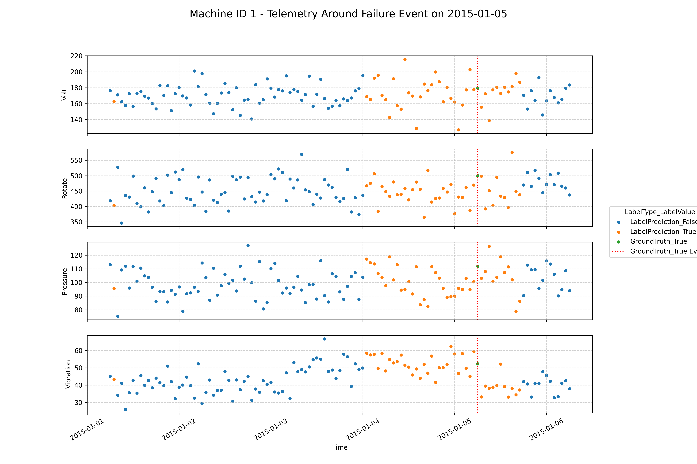

# Predictive Maintenance Machine Learning Pipeline

This repository contains a complete machine learning pipeline for predictive maintenance using sensor data from industrial machines. The project predicts machine failures based on telemetry data, error logs, and maintenance records.

## Project Structure

```
.
├── features/
│   └── data_utilities.py      # Utility functions for data splitting and preparation
│   └── data_download.py       # Script to download data from KaggleHub
│   └── data_preparation.py # Core script for data loading, feature engineering, processing
├── models/
│   ├── h2o_classifier.py  # H2O AutoML training, prediction, and visualization
│   └── logistic_classifier.py # Scikit-learn Logistic Regression training & evaluation
├── plots/                 # Stores EDA plots (e.g., correlation heatmap)
├── predictions/           # Stores prediction visualization plots
├── telemetry/             # Raw data CSV files (populated by data_download.py)
├── data/                 # Stores processed data, models, feature importance, predictions
├── tests/
│   └── test_data_preparation.py # Pytest tests for data preparation output
├── requirements.txt       # Python dependencies
└── README.md              # This file
```

## Data Sources

The project uses several datasets downloaded into the `telemetry/` directory:

- `PdM_telemetry.csv`: Time series sensor data (volt, rotate, pressure, vibration)
- `PdM_errors.csv`: Error logs from machines
- `PdM_failures.csv`: Records of machine failures
- `PdM_maint.csv`: Maintenance records
- `PdM_machines.csv`: Machine metadata (ID, model type, age)

## Data Preparation (`features/data_preparation.py`)

This script performs the core data loading, cleaning, feature engineering, and processing steps:

1.  **Load Raw Data:** Reads CSV files from the `telemetry/` directory.
2.  **Combine & Filter Events:** Merges error, failure, and maintenance records. Filters for the relevant time period (2015).
3.  **Pivot & Curate Events:** Pivots event data, creates flags (`isMaintenanceEvent`, `isErrorEvent`, `isFailureEvent`, `isScheduled`), and tracks error counts since the last maintenance (including `CountOfDoubleErrorsSinceLastMaintenance`).
4.  **Add Lag Features:** Calculates rolling window statistics (min, median, mean, max, var) for telemetry data over various time windows (1h, 6h, ..., 168h).
5.  **Join Telemetry & Events:** Merges the processed telemetry (with lag features) and the curated event data.
6.  **Impute Error Counts:** Fills missing error counts between maintenance events using forward fill.
7.  **Localize Events:** Adds features like time until the next failure (`NextFailureTimestamp`) and time since the last maintenance on specific components (`TimeSinceLastMaintenanceCompN`).
8.  **Save Final Data:** Outputs the fully processed DataFrame to `data/final.csv` and intermediate steps to other files in `data/`.

## Modeling

Two modeling approaches are implemented in the `models/` directory:

### 1. H2O AutoML (`models/h2o_classifier.py`)

-   **Training (`train` function):**
    -   Uses `data_utilities.prepare_binary_classifier_trainset` (likely filtering `final.csv`) to get data for maintenance periods.
    -   Splits data into time-based training/testing sets.
    -   Trains an H2O AutoML model, saving the leader model to `data/`.
    -   Prints performance metrics (AUC, LogLoss, Accuracy, Precision, Recall) and saves feature importance.
-   **Prediction (`generate_preds` function):**
    -   Loads a pre-trained H2O model.
    -   Uses `data_utilities.prepare_binary_classifier_trainset` to get data for non-maintenance periods.
    -   Generates predictions in chunks and saves the combined predictions to `data/h2o_predictions.csv`.
-   **Contextualization & Visualization:**
    -   `contextualize_preds`: Combines H2O predictions with ground truth failure data, saving to `data/combined_labels.csv`.
    -   `visualize_preds`: Generates plots showing telemetry data around specific failure events, saved to `predictions/`.
    -   `visualize_all_preds`: Generates a plot showing the full telemetry history for a machine, colored by prediction/truth, saved to `predictions/`.

### 2. Logistic Regression (`models/logistic_classifier.py`)

-   Uses `data_utilities.prepare_binary_classifier_trainset` to get data for maintenance periods.
-   Splits data into time-based training/testing sets.
-   Applies preprocessing (imputation, scaling, one-hot encoding) via a Scikit-learn pipeline.
-   Trains a `LogisticRegression` model.
-   Evaluates the model, printing metrics and confusion matrix.
-   Saves feature importance (coefficients) to `data/logistic_regression_feature_importance.csv`.
-   Saves test set predictions to `data/logistic_regression_predictions.csv`.
-   Generates and saves a feature correlation heatmap to `plots/`.

## Running the Pipeline

1.  **Setup & Authentication:**
    -   Install dependencies: `pip install -r requirements.txt`
    -   Ensure you have a Kaggle API token configured for `kagglehub` (see `data_download.py`).
2.  **Download Data:**
    ```bash
    python data_download.py
    ```
3.  **Prepare Data & Features:**
    ```bash
    python features/data_preparation.py
    ```
    *(This step takes several minutes)*
4.  **Train Models (Choose one or both):**
    -   **H2O AutoML:**
        ```bash
        python models/h2o_classifier.py train
        ```
        *(Note: The script currently needs modification to accept 'train' as a command-line argument or separate training logic)*
    -   **Logistic Regression:**
        ```bash
        python models/logistic_classifier.py
        ```
5.  **Generate H2O Predictions & Visualizations:**
    -   *(Modify `models/h2o_classifier.py` to set the correct path to your trained H2O model)*
    ```bash
    python models/h2o_classifier.py
    ```
    *(Runs prediction, contextualization, and visualization by default if `train` argument is not provided)*
6.  **Run Tests:**
    ```bash
    pytest tests/test_data_preparation.py
    ```

## Model Results & Outputs

- **H2O AutoML:** Performance metrics printed, best model saved in `data/`, feature importances in `data/feature_importances.csv`.
- **Logistic Regression:** Performance metrics printed, feature importances (coefficients) in `data/logistic_regression_feature_importance.csv`, predictions in `data/logistic_regression_predictions.csv`, correlation heatmap in `plots/feature_correlation_heatmap.png`.
    - **Top 10 Features (by absolute coefficient):**
        1. `CountOfDoubleErrorsSinceLastMaintenance` (+3.436)
        2. `volt_24h_mean` (+2.564)
        3. `pressure_24h_mean` (+1.837)
        4. `vibration_24h_mean` (+1.492)
        5. `isScheduled_True` (-0.845)
        6. `model_model1` (+0.688)
        7. `model_model4` (-0.676)
        8. `model_model3` (-0.672)
        9. `CountOfError5SinceLastMaintenance` (+0.660)
        10. `rotate_24h_mean` (-0.650)
- **H2O Predictions:** Raw predictions saved temporarily (`combined.csv`), contextualized labels saved (`combined_labels.csv`), visualization plots saved in `plots/` (e.g., `prediction_viz_machine_1_event_2015-01-05.png`).

## Modeling Notes

I decided to train only on records with labels (both unscheduled and scheduled maintenance events). In principle, we might expect some machines to occasionally be in a failure state before the technician arrives. h2o_predict.py uses the trained model to generate predictions for failure for the ~900k non-maintenance events. As showcased in the following figure, this approach is sometimes able to detect these failures up to 24 hours in advance. 

It would be interesting to

1. Generate a smoothing or thresholding rule (e.g., send technician if 3 samples are predicted positive in past 4 hours)
2. Compute how far in advance this smoothed prediction is, in hours.
3. Compare that signal with one derived from alternative training approach.

## Prediction Visualization Example (Machine 1, Event 2015-01-05)


