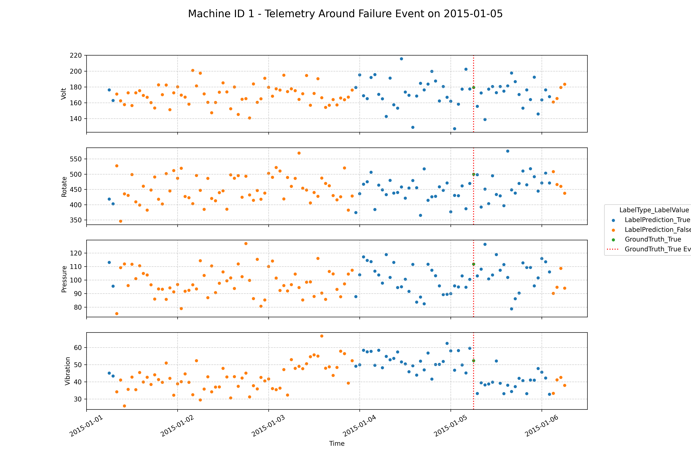

# Predictive Maintenance Machine Learning Pipeline

This repository contains a complete machine learning pipeline for predictive maintenance using sensor data from industrial machines. The project predicts machine failures based on telemetry data, error logs, and maintenance records.

## Project Structure

- **Data Utilities:**
  - `data_utilities.py`: Contains common functions for data loading, preparation (feature selection, merging metadata), and time-based splitting.
- **Exploratory Data Analysis (EDA):**
  - `eda_event.py`: Processes and analyzes event data (errors, failures, maintenance).
  - `eda_telemetry.py`: Processes and analyzes telemetry sensor data.
- **Modeling Scripts:**
  - `h2o_train.py`: Trains an H2O AutoML model on maintenance event data to predict failures.
  - `h2o_predict.py`: Loads a trained H2O model, predicts on non-maintenance data, combines predictions with ground truth, and visualizes results.
  - `logistic_regression.py`: Trains and evaluates a Scikit-learn Logistic Regression model on maintenance event data.
- **Data Storage:**
  - `telemetry/`: Contains raw input data files.
  - `data/`: Stores processed intermediate files, saved models (H2O), feature importances, correlation heatmaps, and predictions.
  - `plots/`: Stores generated visualizations (e.g., prediction plots).

## Data Sources

The project uses several datasets in the `telemetry/` directory:

- `PdM_telemetry.csv`: Time series sensor data (volt, rotate, pressure, vibration)
- `PdM_errors.csv`: Error logs from machines
- `PdM_failures.csv`: Records of machine failures
- `PdM_maint.csv`: Maintenance records
- `PdM_machines.csv`: Machine metadata (ID, model type, age)

## Feature Engineering (via `data_utilities.py`)

The data processing pipeline (`prepare_data` function) includes:

- **Data Merging:** Combines telemetry, events (optional filtering for maintenance/non-maintenance), and machine metadata.
- **Feature Selection:** Removes columns unsuitable for training (e.g., identifiers, event types, specific error/component flags, user-defined lag/aggregation features).

*(Note: Previous extensive feature engineering steps like rolling window aggregations are now assumed to be present in the input `imputed_joined_df.csv` or handled differently)*

## Model Training & Prediction

Two distinct modeling approaches are implemented:

1.  **H2O AutoML (`h2o_train.py`):**
    - Loads and prepares maintenance (~2.2k records) event data using `data_utilities.prepare_data`.
    - Splits data into time-based training and testing sets.
    - Initializes H2O and trains an AutoML model (`H2OAutoML`).
    - Saves the best performing model (`leader`) to the `data/` directory.
    - Evaluates the leader model on the test set and prints performance metrics.
    - Saves feature importances.
2.  **H2O Prediction & Visualization (`h2o_predict.py`):**
    - Loads and prepares non-maintenance (~900k records) event data .
    - Loads a pre-trained H2O model (specified by path).
    - Generates predictions on the non-maintenance data (in chunks).
    - Combines predictions with ground truth labels from maintenance data (`contextualize_preds`).
    - Visualizes telemetry data around failure events for specific machines, coloring points by prediction/ground truth (`visualize_preds`).

3.  **Scikit-learn Logistic Regression (`logistic_regression.py`):**
    - Loads and prepares maintenance (~2.2k records)event data using `data_utilities.prepare_data`.
    - Splits data into time-based training and testing sets.
    - Defines a preprocessing pipeline (`ColumnTransformer`) involving imputation, scaling (numeric features), and one-hot encoding (categorical features).
    - Builds a pipeline including the preprocessor and `LogisticRegression`.
    - Trains the model.
    - Evaluates the model on the test set and prints performance metrics (Accuracy, ROC AUC, Precision, Recall, F1, Confusion Matrix).
    - Saves feature importance (coefficients) and test set predictions/probabilities.
    - Generates a feature correlation heatmap to check for collinearity.

## Running the Pipeline

1.  Install dependencies:
    ```bash
    pip install -r requirements.txt
    ```

2.  **Run EDA scripts (to generate training set):**
    ```bash
    python eda_event.py
    python eda_telemetry.py
    ```

3.  **Train H2O AutoML model:**
    ```bash
    python h2o_train.py
    ```


4.  **Generate H2O predictions and visualizations (ensure model path is set correctly):**
    ```bash
    python h2o_predict.py
    ```

5.  **Train Logistic Regression model:**
    ```bash
    python logistic_regression.py
    ```

## Model Results & Outputs

- **H2O AutoML:** Performance metrics printed during training, best model saved in `data/`, feature importances in `data/feature_importances.csv`.
- **Logistic Regression:** Performance metrics printed, feature importances in `data/logistic_regression_feature_importance.csv`, predictions in `data/logistic_regression_predictions.csv`, correlation heatmap in `plots/`.
    - **Top 10 Features (by absolute coefficient):**
        1. `CountOfDoubleErrorsSinceLastMaintenance` (+3.436)
        2. `volt_24h_mean` (+2.564)
        3. `pressure_24h_mean` (+1.837)
        4. `vibration_24h_mean` (+1.492)
        5. `isScheduled_True` (-0.845)
        6. `model_model1` (+0.688)
        7. `model_model4` (-0.676)
        8. `model_model3` (-0.672)
        9. `CountOfError5SinceLastMaintenance` (+0.660)
        10. `rotate_24h_mean` (-0.650)
- **H2O Predictions:** Raw predictions saved temporarily (`combined.csv`), contextualized labels saved (`combined_labels.csv`), visualization plots saved in `plots/` (e.g., `prediction_viz_machine_1_event_2015-01-05.png`).

## Modeling Notes

I decided to train only on records with labels (both unscheduled and scheduled maintenance events). In principle, we might expect some machines to occasionally be in a failure state before the technician arrives. h2o_predict.py uses the trained model to generate predictions for failure for the ~900k non-maintenance events. As showcased in the following figure, this approach is sometimes able to detect these failures up to 24 hours in advance. 

It would be interesting to

1. Generate a smoothing or thresholding rule (e.g., send technician if 3 samples are predicted positive in past 4 hours)
2. Compute how far in advance this smoothed prediction is, in hours.
3. Compare that signal with one derived from alternative training approach.

## Prediction Visualization Example (Machine 1, Event 2015-01-05)

 